# Architecture Manual - MediaForge

This document describes the subsystem modules, threading structure, and design principles of **MediaForge**.

---

## 🏗️ Architectural Layout

MediaForge is divided into decoupled packages built to isolate daemon management from user interface client dashboards:

```text
src/
├── main.py             # CLI Router & Application Bootstrapper
├── config.py           # Configuration manager & YAML profiles parser
├── db.py               # SQLite transactional layer & migrations runner
├── logger.py           # Structured JSON daily log writers
├── event_bus.py        # Centralized pub-sub event router
├── watcher.py          # Watchdog folder observer
├── scheduler.py        # Sequential FIFO worker thread scheduler
├── executor.py         # Multi-stage transcode pipeline runner
├── notifier.py         # notify-send desktop notification integration
├── ipc.py              # UNIX Domain Socket server & client protocols
├── gui.py              # PySide6 system tray GUI interface
└── processors/
    ├── converter.py    # FFmpeg builder & progress decoder
    ├── thumbnail.py    # Poster frame extractor
    └── metadata.py     # FFprobe metadata parser
```

---

## 🧵 Threading and Concurrency Design

To maintain strict responsiveness targets on the GUI and command-line while running intense transcoding jobs, operations are distributed across isolated threads:

```mermaid
gantt
    title Subsystem Execution Streams
    dateFormat  S
    axisFormat %S
    section GUI Loop
    PyQt Dashboard Loop        :active, gui1, 0, 10
    section IPC Server
    UDS Listener Thread        :active, ipc1, 0, 10
    section Watchdog
    Watchdog File Listener     :active, watch1, 0, 10
    section Worker
    FIFO Queue Scheduler       :active, sched1, 0, 10
```



1. **GUI Main Thread**: Coordinates PySide6 Qt rendering, windows event loops, and client IPC queries.
2. **IPC Server Thread**: Listens on the UNIX Domain Socket (`mediaforge.sock`) and processes requests concurrently.
3. **Folder Watchdog Threads**: Run in the background via the watchdog library to capture kernel folder change events (`IN_CLOSE_WRITE`, `IN_MOVED_TO`) and queue files.
4. **Queue Scheduler Worker Thread**: Polls SQLite for `queued` entries sequentially and executes the transcoding pipelines.

---

## 💾 Cache and Telemetry Layout
* **Duplicate Detection**: The engine computes SHA256 file hashes. If a hash matches an entry in the `history` table, the engine moves the original and bypasses transcoding, eliminating redundant operations.
* **FFprobe Metadata Cache**: Video characteristics (width, height, duration) are saved in the `metadata` cache table, eliminating secondary shell calls on repeat runs.
