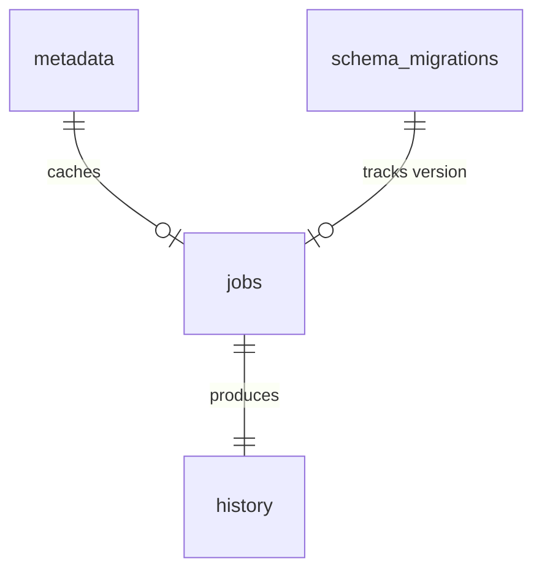

# Database Manual - MediaForge SQLite Schema

This document specifies the SQLite schema design, tables, relationships, indexes, and database migrations architecture for **MediaForge**.

---

## 📊 Database Schema Relationships

---

## 🗄️ Tables and Column Specs

### 1. `schema_migrations`
Tracks SQL version upgrades applied sequentially by the database initializer.
* **`version`** (`INTEGER PRIMARY KEY`): The migration file prefix sequence (e.g. `1`, `2`).
* **`applied_at`** (`TIMESTAMP DEFAULT CURRENT_TIMESTAMP`): Date/time the version script ran.

### 2. `metadata`
Caches FFprobe metadata extractions by SHA256 hashes to prevent redundant, expensive binary queries.
* **`sha256`** (`TEXT PRIMARY KEY`): Canonical file hash.
* **`filepath`** (`TEXT NOT NULL`): The source filepath queried.
* **`codec`** (`TEXT NOT NULL`): Video codec identifier (e.g. `h264`, `hevc`).
* **`width`** (`INTEGER`), **`height`** (`INTEGER`): Video frame dimensions.
* **`fps`** (`REAL`): Framerate.
* **`duration`** (`REAL`): Footage duration in seconds.
* **`rotation`** (`INTEGER DEFAULT 0`): Rotation angle metadata.
* **`created_at`** (`TIMESTAMP DEFAULT CURRENT_TIMESTAMP`): Row cache date.

### 3. `jobs`
Queue table tracking tasks sequentially processed by the Queue Scheduler.
* **`id`** (`INTEGER PRIMARY KEY AUTOINCREMENT`): Auto-incrementing job ID (FIFO).
* **`filepath`** (`TEXT NOT NULL`): Watched path of the file in `Incoming/`.
* **`sha256`** (`TEXT NOT NULL`): File hash (computed during analyzing state).
* **`profile_name`** (`TEXT NOT NULL`): Ingestion profile YAML identifier (e.g. `youtube`).
* **`status`** (`TEXT DEFAULT 'queued'`): Pipeline state constrained by CHECK constraint:
  `CHECK(status IN ('queued', 'analyzing', 'converting', 'post_processing', 'moving', 'completed', 'failed', 'duplicate', 'cancelled'))`
* **`progress`** (`REAL DEFAULT 0.0`): Percentage progress parsed from FFmpeg.
* **`eta_seconds`** (`REAL DEFAULT 0.0`): Dynamic remaining time estimation.
* **`error_message`** (`TEXT`): Error string if status shifts to `failed`.
* **`reason`** (`TEXT`): Reason for duplicate bypass (`sha256_match`) or cancellation limits.
* **`created_at`** (`TIMESTAMP DEFAULT CURRENT_TIMESTAMP`): Ingest queue date.
* **`started_at`** (`TIMESTAMP`), **`completed_at`** (`TIMESTAMP`): Pipeline lifecycle timestamps.

### 4. `history`
Telemetry logs documenting past ingest executions.
* **`id`** (`INTEGER PRIMARY KEY AUTOINCREMENT`): Primary ID.
* **`job_id`** (`INTEGER`): Reference to the job ID.
* **`original_name`** (`TEXT NOT NULL`), **`original_path`** (`TEXT NOT NULL`): Source file information.
* **`converted_path`** (`TEXT NOT NULL`): Final output clips file path.
* **`sha256`** (`TEXT NOT NULL`): Original file hash.
* **`original_size`** (`INTEGER NOT NULL`), **`converted_size`** (`INTEGER NOT NULL`): File footprint size.
* **`duration`** (`REAL NOT NULL`): Media duration in seconds.
* **`conversion_time_seconds`** (`REAL NOT NULL`): Total time taken to transcode.
* **`avg_speed`** (`REAL NOT NULL`): Encoding multiplier (e.g. `1.2x`).
* **`status`** (`TEXT NOT NULL`): Constrained by CHECK constraint:
  `CHECK(status IN ('completed', 'failed', 'duplicate', 'cancelled'))`
* **`reason`** (`TEXT`): Reason code for terminal state (e.g. `sha256_match`).
* **`timestamp`** (`TIMESTAMP DEFAULT CURRENT_TIMESTAMP`): Archive timestamp.

### 5. `settings`
Persistent application parameter cache.
* **`key`** (`TEXT PRIMARY KEY`): Configuration parameter key (e.g. `incoming_folder`).
* **`value`** (`TEXT NOT NULL`): String value.

---

## ⚡ Indexing Optimization

To support rapid duplicate checks and GUI statistics updates, the following indexes are declared:

* **Hash lookup index** (`CREATE INDEX IF NOT EXISTS idx_history_sha256 ON history(sha256);`): Speeds up duplicate checks against the database cache.
* **Job state index** (`CREATE INDEX IF NOT EXISTS idx_jobs_status ON jobs(status);`): Accelerates sequential FIFO queue lookups.
