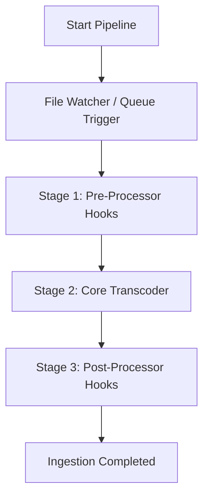

# Plugin SDK - MediaForge Processor Interface

This document specifies the extensibility framework and processor contracts designed to guide contributions to future releases of MediaForge.

---

## 🔌 Processor Lifecycle

All execution stages within the ingestion pipeline are defined as custom processors. The execution flow is governed by `PipelineExecutor`:



---

## 📝 Custom Processor Interface

Every processor hook must inherit from the baseline `BaseProcessor` class (to be exported in `src.processors.base`):

```python
from abc import ABC, abstractmethod
from pathlib import Path
from typing import Any

class BaseProcessor(ABC):
    """
    Defines the contract for pipeline processing modules.
    """
    def __init__(self, config: dict[str, Any]) -> None:
        self.config = config

    @property
    @abstractmethod
    def name(self) -> str:
        """
        Unique identifier of the processor plugin.
        """
        pass

    @abstractmethod
    def run(self, input_path: Path, output_dir: Path, context: dict[str, Any]) -> bool:
        """
        Executes the processor logic.
        
        Args:
            input_path: Path to the original input file.
            output_dir: Target destination folder.
            context: Shared dict state across processors (e.g. metadata).
            
        Returns:
            True if the execution completed successfully, False otherwise.
        """
        pass
```

---

## 🎨 Example Plugin: Audio Loudness Normalizer

To extend processing routines, developers can write hooks targeting `post_processing` events:

```python
import subprocess
from pathlib import Path
from typing import Any
from src.processors.base import BaseProcessor

class LoudnessNormalizer(BaseProcessor):
    @property
    def name(self) -> str:
        return "loudness_normalizer"

    def run(self, input_path: Path, output_dir: Path, context: dict[str, Any]) -> bool:
        # Check if target loudness is specified
        target_db = self.config.get("target_loudness_db", -24)
        
        # Build ffmpeg call to run loudnorm filter
        temp_out = output_dir / f"{input_path.stem}_norm{input_path.suffix}"
        
        cmd = [
            "ffmpeg", "-y", "-i", str(input_path),
            "-af", f"loudnorm=I={target_db}:TP=-1.5:LRA=11",
            "-c:v", "copy", # Copy video stream without re-encoding
            str(temp_out)
        ]
        
        result = subprocess.run(cmd, capture_output=True)
        if result.returncode == 0:
            # Overwrite original with normalized version
            shutil.move(temp_out, input_path)
            return True
        return False
```

---

## 🛠️ Hook Registration Contract

Hooks register inside `config/config.yaml` using dynamic routing structures:

```yaml
processors:
  pre_processing:
    - name: "integrity_checker"
      enabled: true
  post_processing:
    - name: "loudness_normalizer"
      enabled: true
      config:
        target_loudness_db: -23
    - name: "whisper_transcription"
      enabled: false
```
For V1, hooks are hardcoded or stubbed inside `executor.py` to preserve performance and prevent configuration complexity.
