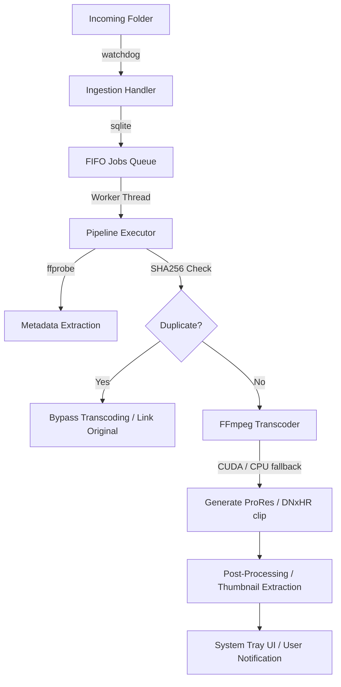

# MediaForge 🛠️🎥

**MediaForge** is a production-grade automated media ingestion and transcoding engine optimized for local non-linear video editing workstations. Designed for editors who work with heavy editing formats like Apple ProRes or Avid DNxHR, it automatically monitors watched directories, handles background transcoding with hardware acceleration fallback, and prevents redundant storage operations via integrated duplicate cache detection.

---

## ✨ Features

* **🚀 Automated Folder Monitoring**: Native background directory watcher (using `watchdog`) detects new footage copies instantly.
* **🛡️ Sequential Queue Scheduler**: Worker loop processes jobs one-by-one to preserve precious workstation CPU/GPU power for active NLE (DaVinci Resolve/Kdenlive/Shotcut) timelines.
* **🏎️ Hardware Acceleration Fallback**: Auto-detects NVIDIA CUDA support, scaling back gracefully to CPU-based decoding if drivers or decoders fail.
* **💾 Smart Duplicate Bypass Cache**: Computes SHA256 hashes on ingestion, skipping duplicate files to save disk writes.
* **📂 Automated Path Recovery**: Gracefully recreates target directories on the fly if user deletes clips or originals mid-transcode.
* **💬 Unix Domain Socket IPC**: Direct UDS socket communication maps lightning-fast daemon metrics to user CLI and Tray UI clients.
* **🖥️ System Tray Dashboard**: PyQt-based tray interface displays queue telemetry, stats, and controls.

---

## 🏗️ Architecture Overview

MediaForge splits active folder monitoring from execution steps using a thread-isolated daemon architecture:



---

## 🛠️ Installation

### Prerequisites
* Fedora 44 (or modern Linux distribution)
* Python 3.11+
* FFmpeg and FFprobe binaries
* NVIDIA GPU (Optional, for CUDA decoding support)

### Installation Steps

1. **Clone the repository**:
   ```bash
   git clone https://github.com/UtkarshD18/MediaForge.git
   cd MediaForge
   ```

2. **Initialize python environment using `uv`**:
   ```bash
   uv venv
   source .venv/bin/activate
   uv pip install -e .
   ```

3. **Validate environment health**:
   ```bash
   mediaforge doctor
   ```

---

## 🚀 Usage & CLI Examples

### Start the Ingestion Daemon
```bash
mediaforge watch
```

### Query Daemon Telemetry
```bash
mediaforge status
```

### Inspect the Jobs Queue
```bash
mediaforge queue
```

### Toggle Worker Execution
```bash
mediaforge pause
mediaforge resume
```

### Cancel Active Transcode
```bash
mediaforge cancel
```

---

## ⚙️ Configuration

System parameters and profiles are declared inside `config/config.yaml`. Example:

```yaml
version: 1
incoming_folder: "~/Videos/Incoming"
originals_folder: "~/Videos/Originals"
resolve_clips_folder: "~/Videos/DaVinci/clips"
active_profile: "youtube"   # Targets ProRes 422 HQ
stability_duration: 2.0     # Time (seconds) to verify file transfers are finished

features:
  thumbnails: true
  notifications: true
  gpu_monitor: true
```

---

## 🗺️ Roadmap

* **v1.1 (Q3 2026)**: NAS network drive polling routines & sidecar JSON metadata exports.
* **v2.0 (Q1 2027)**: Distributed TCP workers for remote render server offloading.
* **v3.0 (Q4 2027)**: AI Whisper smart subtitles and YOLO automatic object tagging.

---

## 📄 License

Distributed under the MIT License. See [LICENSE](LICENSE) for more information.
