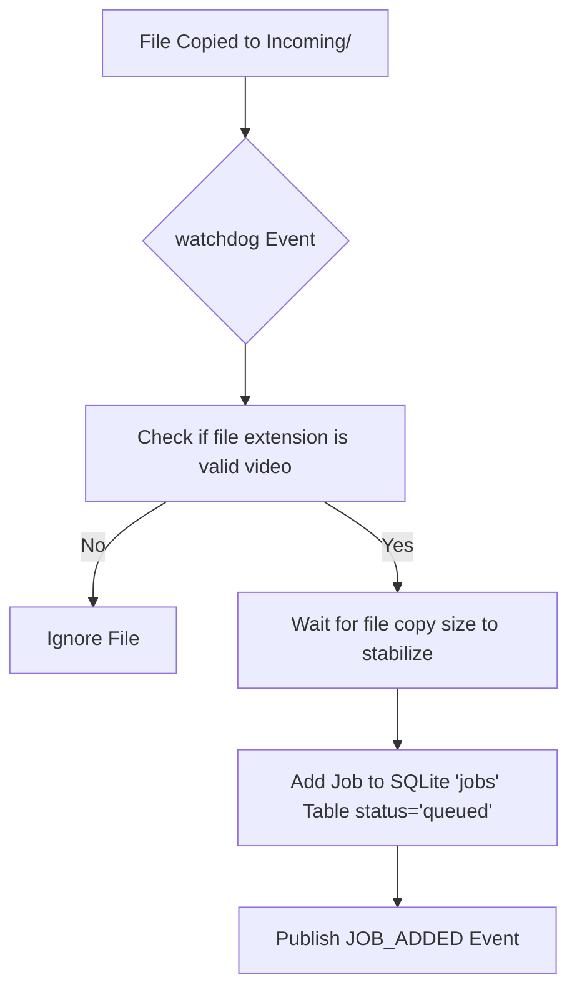
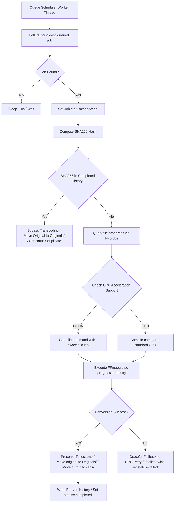
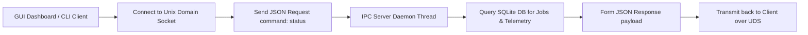

# MediaForge System Flowcharts

This document houses the Mermaid flowcharts detailing the functional pathways of **MediaForge**.

---

## 📂 1. Folder Watching & Ingestion Queue

---

## ⚙️ 2. Transcode Pipeline Execution

---

## 💬 3. Inter-Process Communication (IPC) Socket Flow

